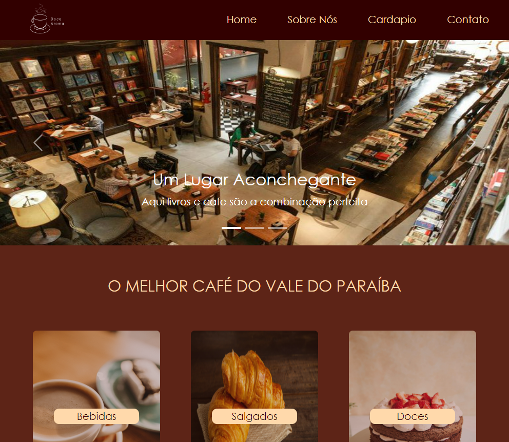
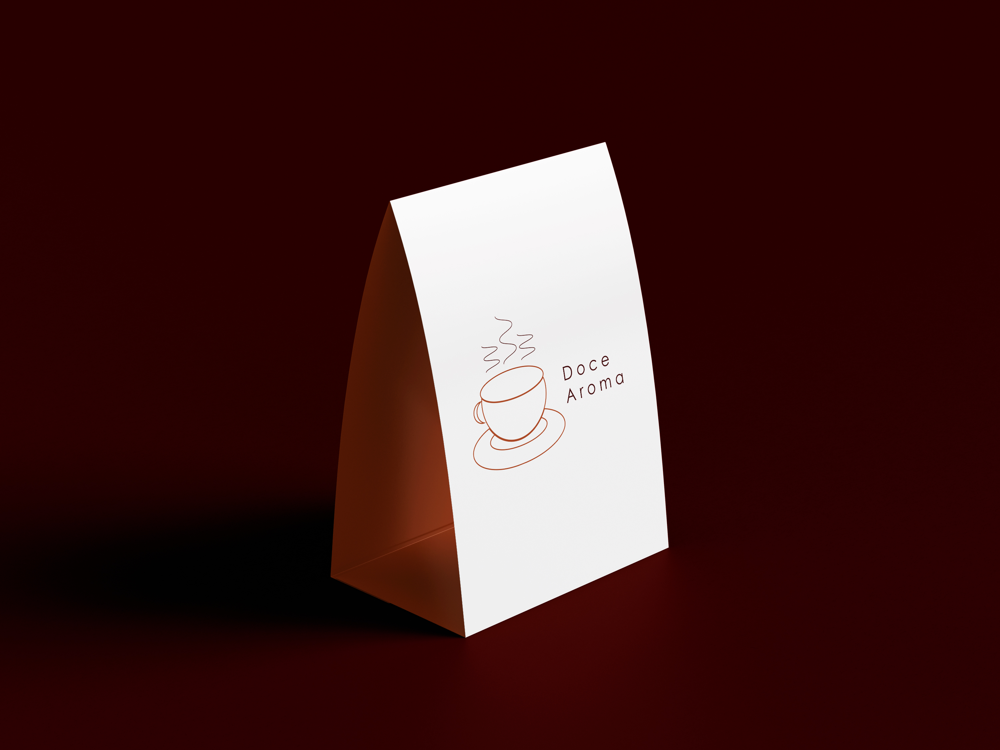

<h1 align="center">DOCE AROMA</h1>

## SOBRE
Esse projeto foi desenvolvido pensando na criação de uma pagina para uma cafeteria chamada Doce Aroma, que é um negócio que une a experiencia de café + livraria.
Pensando nisso desenvolvemos este site, que conta com 4 paginas : Home, Sobre, Cardápio e Contato .



## COMO INSTALAR ?

* Dê um git clone em uma pasta em seu computador e digite no terminal o seguinte comando : npm install next
* Após isso digite no terminal : npm run dev


## TECNOLOGIAS USADAS:
* React
* Bootstrap
* Tailwind

## DIFICULDADES NO DESENVOLVIMENTO:
Uma das dificuldades encontradas elaborando este projeto foi a instalação do bootstrap no react para a inserção do carrossel de imagens, o que acabou sendo resolvido com pesquisas e lidas em documentação.
Além disso, a inserção do Iframe do google maps também foi um pouco complexa mas da mesma forma que foi resolvida a questão do bootstrap também foi resolvida a do bootstrap.

## CARDAPIO:
A pagina do Cardapio foi pensada como a pagina de um produto a ser atualizado por um admistrador da cafetria que não tenha conhecimento em criação de site, foi separado em Datas(Bebidas, Doces, Salgados) para facilitar o administrador inserir ou remover, atualizar preço de forma simples, acessando somente a componente data ele podera fazer essas alterações.

```
const CarDataBebi = [
    {
      id: 1,
      name: 'Café',
      price: 4.99,
    },
    {
      id: 2,
      name: 'Frapuccino',
      price: 9.99,
    },....
```
## EXTRAS:
* Também elaboramos uma logotipo para o projeto utilizando da ferramenta Adobe Illustrator e alguns mockups para utilização no carrossel de imagens. Segue abaixo algumas imagens:


